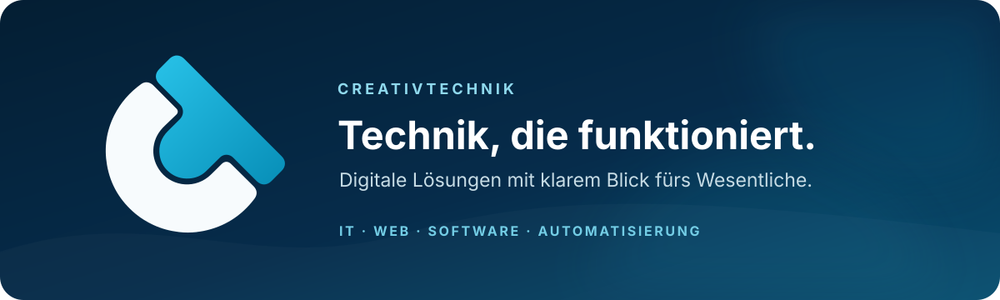

<p align="center">
  
</p>

<p align="center">
  <strong>Wir entwickeln verlässliche Technik und digitale Lösungen für Unternehmen, Organisationen und Projekte.</strong>
  <br>
  Von der technischen Infrastruktur über moderne Websites bis zur individuellen Software verbinden wir Beratung, Umsetzung und langfristige Weiterentwicklung.
</p>

<p align="center">
  <a href="https://creativtechnik.eu"></a>
  
  
</p>

## Was wir entwickeln

| Bereich | Leistungen |
|---|---|
| **IT & Technik** | IT-Beratung und Support, technische Systeme, Fehleranalyse, Netzwerke sowie Hard- und Software-Unterstützung |
| **Webentwicklung** | Konzeption, Webdesign, individuelle Websites, Landingpages und die Weiterentwicklung bestehender Auftritte |
| **Software** | Kleine, passgenaue Anwendungen für macOS und den Browser – mit verständlichen Abläufen und wartbarer Architektur |
| **Digitale Lösungen** | Automatisierungen, schlanke Workflows und Beratung für Prozesse, die einfacher und zuverlässiger werden sollen |

Unser Anspruch: **klare Zuständigkeiten, nachvollziehbare Technik und Lösungen, die im Alltag funktionieren.** Datenschutz, Barrierearmut und lokale Datenverarbeitung denken wir dabei früh mit.

## Ein Unternehmen, zwei klare Bereiche

CreativTechnik verbindet technisches Denken mit einem kreativen Blick. Damit beide Schwerpunkte künftig schneller erkennbar sind, planen wir ihre getrennte Darstellung unter derselben Firma:

```text
CreativTechnik
├── IT & Digitale Lösungen       ← Schwerpunkt dieses GitHub-Profils
└── Videografie & Medienproduktion
```

Auf GitHub zeigen wir deshalb vorrangig **Software, Webentwicklung, IT-Systeme und digitale Werkzeuge**. Videografie, Photographie und Postproduktion bleiben ein eigenständiger Leistungsbereich von CreativTechnik, werden hier aber bewusst nicht mit den technischen Projekten vermischt.

## Öffentliche Projekte

<table>
  <tr>
    <td width="50%" valign="top">
      <h3><a href="https://github.com/CreativTechnik/Filelio">Filelio</a></h3>
      <p>Native macOS-Menüleisten-App zum sicheren Benennen, Sortieren und Verwalten lokaler Dateien.</p>
      <p><code>Swift</code> <code>SwiftUI</code> <code>macOS</code> <code>Local-first</code></p>
    </td>
    <td width="50%" valign="top">
      <h3><a href="https://github.com/CreativTechnik/Mein-Finanzplan">Mein Finanzplan</a></h3>
      <p>Lokale Haushalts- und Liquiditätsplanung für macOS sowie eine getrennte Browser-Variante.</p>
      <p><code>Swift</code> <code>JavaScript</code> <code>macOS</code> <code>Datenschutz</code></p>
    </td>
  </tr>
</table>

Weitere Lösungen entstehen für Websites, redaktionelle Systeme und interne digitale Abläufe. Nicht jedes Projekt ist öffentlich – insbesondere dann, wenn Kundeninhalte, Betriebsdaten oder noch nicht veröffentlichte Arbeiten enthalten sind.

## Technologien im Einsatz

<p>
  
  
  
  
  
  
  
  
  
</p>

Wir wählen Technologien nach Aufgabe und langfristiger Wartbarkeit – nicht nach Trend. Aktuell arbeiten wir vor allem mit nativen macOS-Anwendungen, schlanken Browser-Lösungen und individuell entwickelten WordPress-Systemen.

## Wie wir arbeiten

- **Verstehen:** Anforderungen, bestehende Systeme und tatsächliche Engpässe klären.
- **Vereinfachen:** Den kleinstmöglichen sinnvollen Lösungsweg entwerfen.
- **Umsetzen:** Sauber entwickeln, verständlich dokumentieren und relevante Prüfungen automatisieren.
- **Weiterdenken:** Wartung, Datenschutz, Zugänglichkeit und spätere Erweiterungen berücksichtigen.

## Kontakt

Du planst ein IT-, Web- oder Softwareprojekt oder möchtest einen bestehenden Ablauf verbessern?

**[creativtechnik.eu](https://creativtechnik.eu)** · [GitHub-Projekte](https://github.com/CreativTechnik?tab=repositories)

<sub>CreativTechnik GbR · Berlin / Hamburg</sub>

